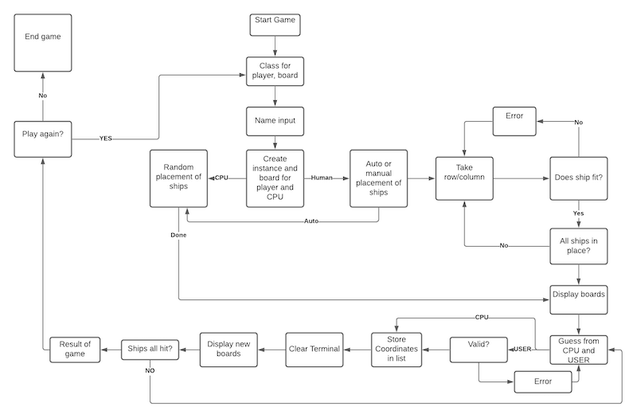
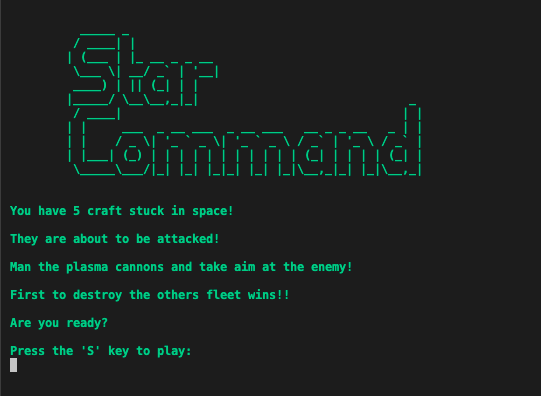
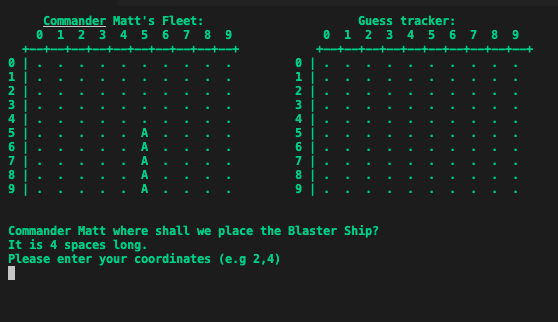
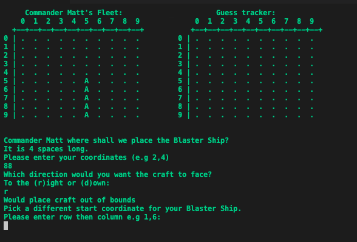
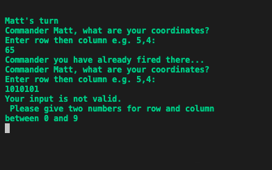

# **Battleships**

[View the live project here.](https://star-command.herokuapp.com/)

This program is a command-line version of the classic board game Battleships, deployed via the Heroku app. 
It is a single-player version of the game, playing against a computerised player. 

---

___

## **Table of Contents**
* [**Battleships**](#battleships)
* [**Planning**](#planning)
* [**Features**](#features)
* [**Data Model**](#data-model)
* [**Languages**](#languages)
* [**Libraries**](#libraries)
* [**Testing**](#testing)
    * [***Issues***](#issues)
* [**Further Testing**](#further-testing)
    * [***Known Bugs***](#known-bugs)
    * [***Improvements***](#improvements)
* [**Deployment**](#deployment)
* [**Credits**](#credits)
* [**Code**](#code)
    * [***Content***](#content)
    * [***Acknowledgements***](#acknowledgements)

# **Planning**
## ***User Stories:***
As a User, I want to be able to:
* Understand what the game is straight away.
* To have a fun time playing the game with easy to follow commands.

## ***Aim of Site***
1. Make it clear what the game is without need for explaination.
    * A welcome screen with ascii art and scrolling story will help achieve this.
1. Give a valid and clear response to all User input without the game crashing. 
    * All user input is handled and any exception is returned with a message to the User. 
1. Have an enjoyable experience of a classic kids game. 
    * The feedback given through the terminal without it getting cluttered on screen achieves this. 

## ***Flow Chart***
To explain the flow of the game, I created a flow chart:

# **Features**

## ***Welcome Screen:***
Here the User will be given a brief outline of the story and rules and will be prompted to start the game:

## ***Name Input/Setup:***
After being prompted for their name, the User will be asked if they wish to manually place their ships or allow the computer to do it for them:

## ***Manual placement:***
If the User selects to set up their fleet manually, they will be presented with a board to do so:

If the User puts in a invalid location they will be notified:

If their decision would place the craft out of bounds, the follwoing message will advise them such:

## ***Firing round:***

Once the User enters the firing round, they will be presented with a guess board and their own board with their fleet placed. They will be prompted for an input and will be advised if their chosen coordinates are a Hit:

Or a Miss:

They will also be advised of an invalid input:

## **Data Model**

To stay in line with the OOP requirements of the project, I decided to make classes for the Board, Player, Craft and Ships. There is also a Helper class that utilises functions that can be called among all classes. Even though people may see this as surplus to requirements, I feel that this was the best plan of action if I wanted to further develop the game at a later date. 

## **Languages** 

-   [Python](https://en.wikipedia.org/wiki/Python_(programming_language))

## **Libraries** 

    For this project to work successfully, I used the following imported libraries:

1. random:
    - randint used to generate a random integer between 0 and 9 for automated placement of craft and the computer hit guess.

1. time:
    - importing the sleep function from the this library enabled me to delay the typed reposnse to the console for a nicer game flow. It also enabled certain hit or miss statements to be viewed before the terminal was cleared for the reprinting of the boards. 

1. string:
    - I used the ".capwords()" function when a User enters their name to give them correct casing. 

1. os:
    - Used to clear the terminal so the screen could reset between input and keep everything clean.

---

## **Testing**

PEP8 online [(here)](http://pep8online.com/) was used to run through and check code met all validations and conventions. All pages passed with no issues, except for the "no newline at end of file" warning which is a known issue with this particualr CI template that I am using. 

---

## ***Issues***
    
1. AI was only placing ships horizontally. User unable to place ships vertically.
    
    * Indentation error in build_craft() was causing issue. 

2. When being placed automatically, the 5-tile craft would only place 2 tiles on a populated board. 

    * In the build_craft() fucntion, the y coordinate was using + 1 rather than + i, 
    causing it to be calculated as 2 tiles long. After chaning to + i, the issue was resolved. 

3. Game was not finished when all fleet was destroyed or all tiles filled. 

    * The check_shot() function in the Board class was looking at fleet_map for a result rather than fleet_coords that was in the class' __init__. 
    After updating this, the logic flow was completed to the is_fleet_destroyed function in the Game class and the game would complete. 

## **Further Testing**

-   The app was tested on Google Chrome, Firefox, Microsoft Edge and Safari browsers.
-   A large amount of testing was done to ensure that functionality was working as expected.
-   Friends and family members were asked to review the site and documentation to point out any bugs and/or user experience issues.

## ***Known Bugs***

-  If the User inputs their coordinates whilst it is the Computer's turn, their choice will still register. This will either result in an 'automatic' shot when it comes to their turn, or if they type more digits, a validation error. 

## ***Improvements***

-   I would like to implement addditional difficulty AI settings using a checkerboard technique for initial placement [(view)](https://www.youtube.com/watch?v=jMpbYpaKtao&ab_channel=KeithGalli), and an awareness to take shot at surrounding tiles once they have a hit. 
-   A 2-player functionality. 
-   The introduction of more colours in the game, with craft, hits and misses all being a different colour.

---
  
## **Deployment**

### Heroku

This application has been deployed from Github using Heroku. Here's how:

1. Create an account at heroku.com
2. Create a new app, add app name and your region
3. Click on create app
4. Go to "Settings"
5. Under Config Vars, add your sensitive data (creds.json for example)
6. For this project, I set buildpacks to heroku/python and heroku/nodejs and in that order.
7. You must then create a Config Var called PORT. Set this to 8000.
8. Go to "Deploy" and at "Deployment method", click on "Connect to Github"
9. Enter your repository name and click on it when it shows below
10. Choose the branch you want to buid your app from
11. If desired, click on "Enable Automatic Deploys", which keeps the app up to date with your Github repository

### Forking the GitHub Repository 

By forking this GitHub repository you are making a copy of the original to view or make changes without affecting the original. You can do this by following these steps...

1. Log into your GitHub account and find the [repository](https://github.com/sarahjameson/-CI-PP3-Battleship).
2. Click 'Fork' (last button on the top right of the repository page).
3. You will then have a copy of the repository in your own GitHub account. 

### Making a Local Clone

1. Log into your GitHub account and find the [repository](https://github.com/sarahjameson/-CI-PP3-Battleship).
2. Click on the 'Code' button (next to 'Add file'). 
3. To clone the repository using HTTPS, under clone with HTTPS, copy the link.
4. Then open Git Bash.
5. Change the current working directory to where you want the cloned directory to be made.
6. In your IDE's terminal type 'git clone' followed by the URL you copied.
7. Press Enter. 
8. Your local clone will now be made.
---

## **Credits**
* Everything you need to know about Classes in Python by Keith Galli was an extremely useful resource for me - [Here](https://youtu.be/tmY6FEF8f1o) 
* The idea to decorate the board with numbers for indexing the shots was from [Knowledge Mavens youtube channel](https://youtu.be/alJH_c9t4zw)
* Clear console function came from [Geeks for Geeks](https://www.geeksforgeeks.org/clear-screen-python/)
* [lucid chart.com](https://www.lucidchart.com/) was used to create the logic flow chart "flowchart.jpeg"
* [ASCII Art text generator](http://www.network-science.de/ascii/) used for the welcome screen text.
* [Hayoi's Programming Blog](https://www.lihaoyi.com/post/BuildyourownCommandLinewithANSIescapecodes.html) helped with the use of Unicode colour usage.
* To understand the game logic and how to go ahead with the build, I used this video on the [Devpost Youtube channel](https://youtu.be/zSQIGzmcp2I)  
* To better understand the enumerate() and zip() fucntions I came to [nkmk](https://note.nkmk.me/en/python-for-enumerate-zip/)

## **Code**

-   The idea for the project was inspired by a video by [Robert Heaton](https://www.youtube.com/watch?v=Gi0Fdyhk1_0&t=616s&ab_channel=RobertHeaton)

## ***Content***

-   All content was written by the Author, Matt Cooper, except where commented in the code or mentioned above. 

## ***Acknowledgements***

-   My Mentor Antonio Rodriguez for his continuous helpful feedback.

-   My partner Mor for her testing, suggestions and support throughout this build. 

-   The tutors at Code Institute for assisting me at the midnight hour of submission. 